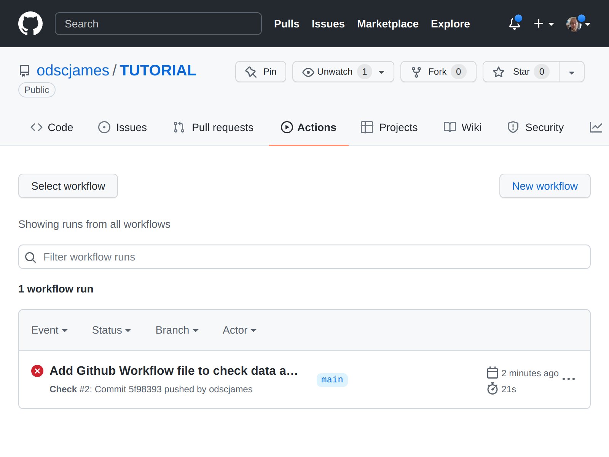
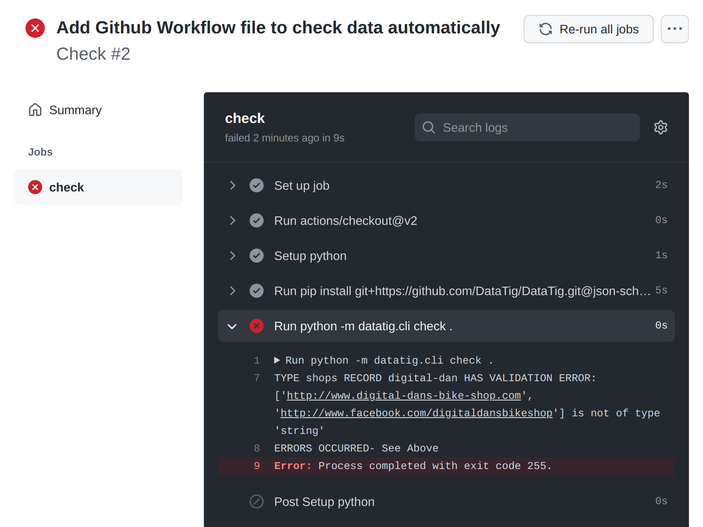
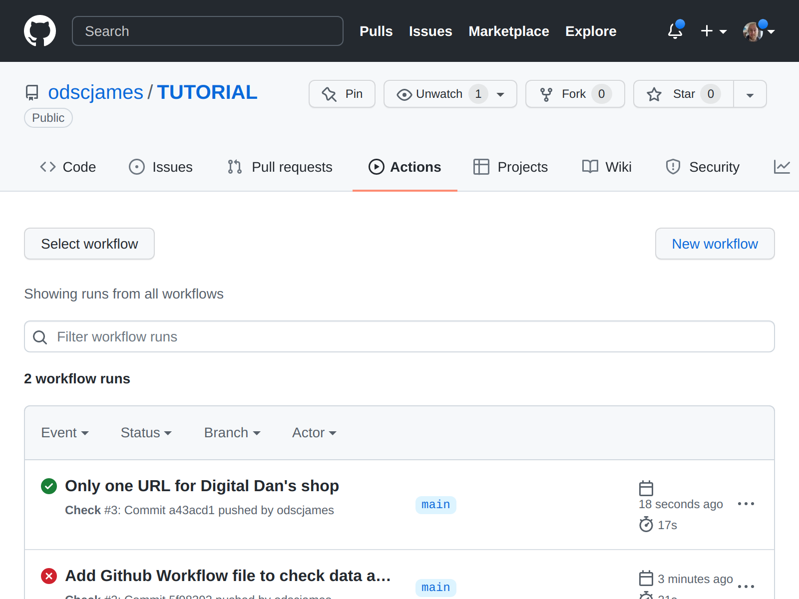

Checking data automatically
===========================

Previous
--------

Before doing this, :doc:`make sure you have done the previous step <specify-structure>`.

What this section covers
------------------------

* We have seen how to check data manually; lets have GitHub check any data automatically

Getting GitHub to check data automatically
------------------------------------------

Previously we have run checks manually by running:

.. code-block:: bash

    python -m datatig.cli check .

This is great, but it's not great we have to remember to do this! It would be very easy to forget.

Fortunately, using a free GitHub feature called Actions we can get GitHub to check our data automatically.

Create a directory called "`.github`". Inside that, create a directory called "`workflows`". Inside that, create a file called "`check.yml`", with the contents:

.. code-block:: yaml

    name: Check
    on: [push, pull_request]

    jobs:
      check:
        runs-on: ubuntu-latest
        steps:
        - uses: actions/checkout@v2
        - name: Setup python
          uses: actions/setup-python@v2
          with:
            python-version: 3.9
            architecture: x64

        - run: pip install datatig
        - run: python -m datatig.cli check .

The contents tell GitHub Actions when to run, how to install your data and DataTig and finally how to get DataTig to check the data. We won't go into the detail of these in this tutorial.

Commit your file `.github/workflows/check.yml` and push it to GitHub.

Go to your repository on GitHub and click the "Actions" tab.

You may have to wait a minute. But after refreshing the tab a few times, you should see GitHub starting to run your action. After a minute it should go Red, indicating that it has failed and indicating that there is a problem with your data.

Click on the run, then check and expand the broken item to see the details of the problem.

Let's try and fix this. We can only list one URL - so let's remove the Facebook one.

Edit the file called `shops/digital-dan.yaml`. Add the URL:

.. code-block:: yaml

    title: Digital Dan's Bike Shop
    url: http://www.digital-dans-bike-shop.com

Commit your file `shops/digital-dan.yaml` and push it to GitHub.

Go to your repository on GitHub and click the "Actions" tab.

Shortly you should see a new job starting and this time, when it has finished it will turn Green, indicating there are no problems with the data.

GitHub will now automatically check any new data you add, and tell you of any problems.

(Note: :doc:`the contents of this section are also available as part of the how-to section <../how-to-guide/use-github-actions-to-check-your-data>` )

Next
----

:doc:`To continue, visit the next section <deploying-static-site>`

