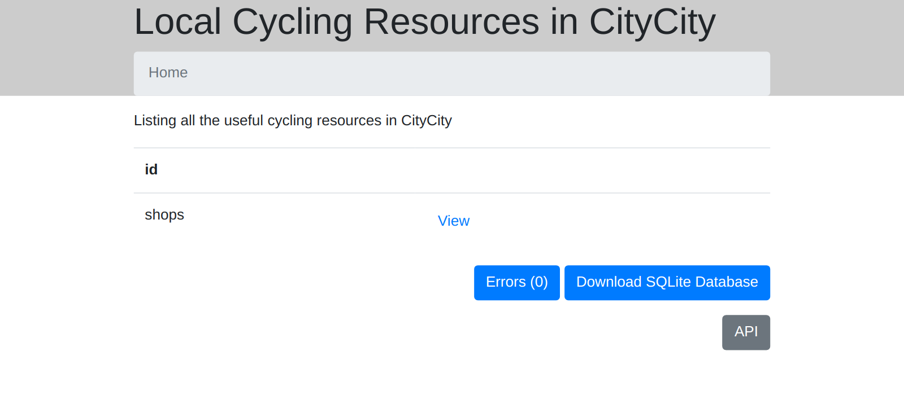

Setting up a site on GitHub
===========================

What this section covers
------------------------

* How to start a new repository and site
* How to add your first data
* How to run the tool and see the website that results

Create a repository on GitHub & clone it
----------------------------------------

The data will be stored in GitHub.

Create a new repository in GitHub and select the `Add a README file` option.

Clone this repository to your local computer.

Set up a DataTig site
---------------------

In order for DataTig to know that a git repository has data it can process, it needs a configuration file.

In the top level of the repository, create a file `datatig.yaml`. It's contents should be:

.. code-block:: yaml

    title: Local Cycling Resources in CityCity
    description: Listing all the useful cycling resources in CityCity

Commit that new file to Git and push to GitHub.

Now let's add our first resources!

Start with some bike shops
--------------------------

You decide that listing bike shops is a good thing to do.

It's always handy to be able to get a small part quickly.

Create a directory called `shops`.

We are going to store our information in a YAML file, one per shop.

Create a file called `alices-bikes.yaml` in the `shops` directory. For the contents, put:

.. code-block:: yaml

    title: Alice's Bikes
    url: http://www.alicesbikeshop.co.uk/

Create a file called `bobs-bikes.yaml` in the `shops` directory. For the contents, put:

.. code-block:: yaml

    title: Bob's Bikes
    url: http://www.bobsbikeshop.co.uk/

Commit these 2 new files to Git and push to GitHub. We've just added our first data!

Tell DataTig about this new data
--------------------------------

Just adding data to the repository isn't enough; we have to tell DataTig about the new data.

To do this, we add information to the `datatig.yml` file we created earlier. Set it's contents to be:

.. code-block:: yaml

    title: Local Cycling Resources in CityCity
    description: Listing all the useful cycling resources in CityCity
    # Every type of data we list should have an entry here
    types:
    # This defines the shops data
    # Every type should have an unique identifier
    - id: shops
    # For every type, we need to know in which directory we can find the data
      directory: shops

Commit this change and push to GitHub.

Install DataTig
---------------

This is the minimal information needed to actually run DataTig, so let's do that now!

First install it:

.. code-block:: bash

    pip install datatig

Use DataTig to check your data
------------------------------

Now we'll run the tool over your data.

The tool can do several actions. It can check the data to make sure that it is in the correct format. To do so, run:

.. code-block:: bash

    python -m datatig check .

This should run with no output, meaning there were no errors.

Use DataTig to build a website about your data
----------------------------------------------

The tool can also build static files that can be served as a website.

This website contains the data in several useful forms.

First, let's build the website.

.. code-block:: bash

    python -m datatig build . --staticsiteoutput _site

This should build fine (you will not see any output) and in the new `_site` directory that just appeared, you should see some files.

We can serve these so they are easy to open in your web browser.

.. code-block:: bash

    sh -c "cd _site && python3 -m http.server"

Now open a web browser and go to http://localhost:8000/

You should see a basic website with a link for shops.

Clicking on "shops" will let you explore the 2 shops we just added. But it only shows us basic information - let's see if we can make that more helpfull.

Next
----

:doc:`To continue, visit the next section <specify-structure>`

