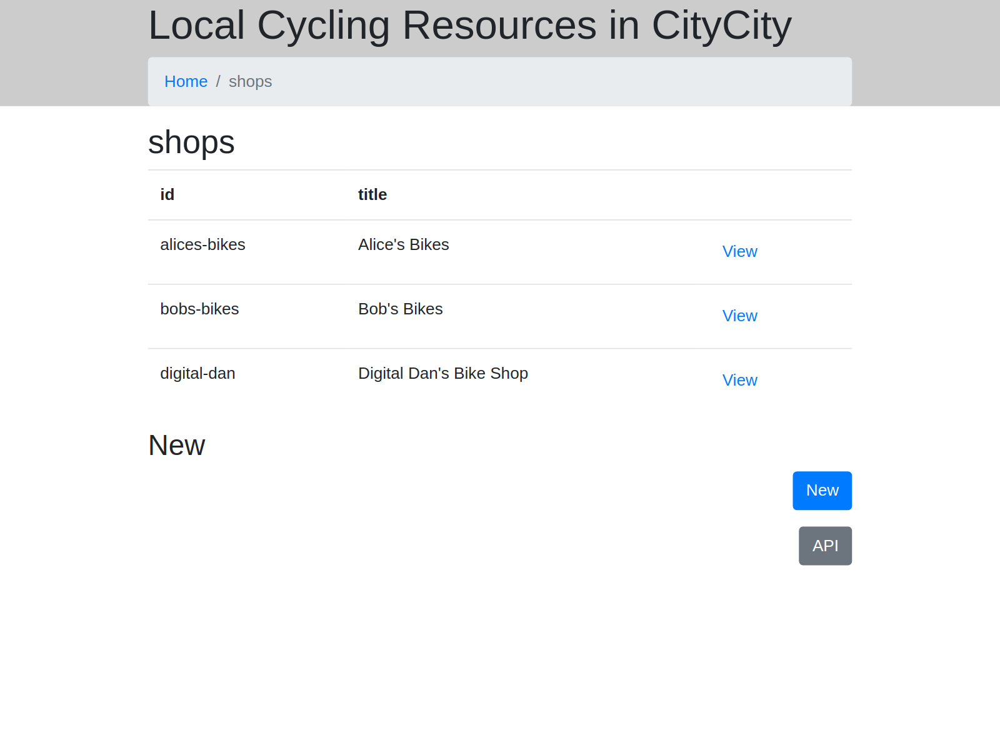
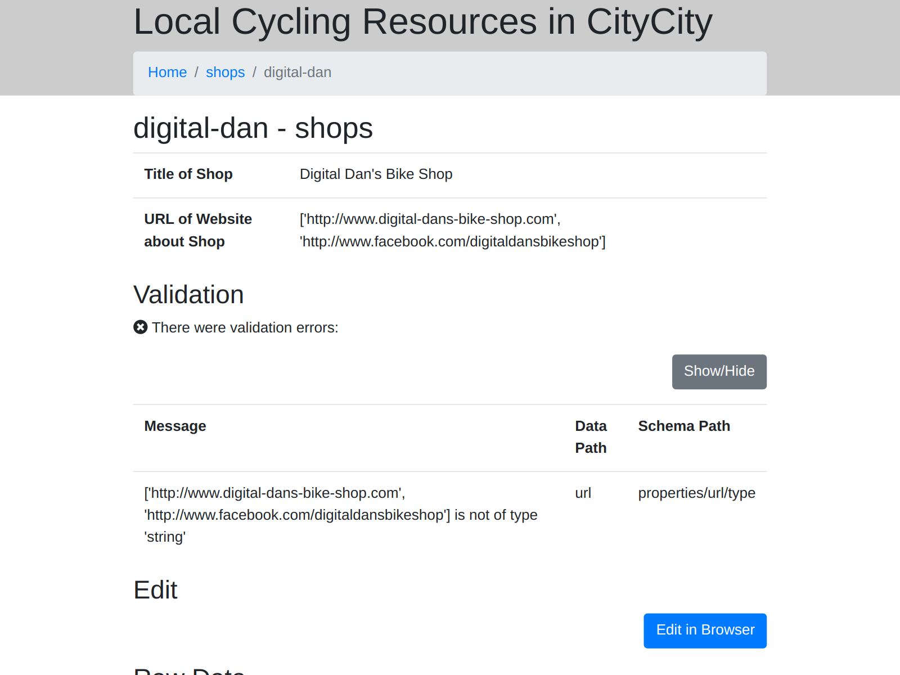

Specifying Structure
====================

Previous
--------

Before doing this, :doc:`make sure you have done the previous step <setting-up-site-and-adding-first-data>`.

What this section covers
------------------------

*  Telling DataTig about the structure of your data so it can be more helpful

Adding Fields Definitions
-------------------------

If we tell DataTig what structure data to expect, it can be much more helpful.

Edit `datatig.yml`. Add in the section about `fields` and `list_fields`:

.. code-block:: yaml

    title: Local Cycling Resources in CityCity
    description: Listing all the useful cycling resources in CityCity
    # Every type of data we list should have an entry here
    types:
    # This defines the shops data
    # Every type should have an unique identifier
    - id: shops
      # For every type, we need to know in which directory we can find the data
      directory: shops
      # Define some fields
      fields:
      # Every field should have an unique identifier
      - id: title
        # For each field, we need to tell it where in the data to look for the value.
        key: title
        # For each field, we should give it a friendly title
        title: Title of Shop
      - id: url
        key: url
        title: URL of Website about Shop
      # We need to tell DataTig which fields are important to list when looking at a list of all the data.
      list_fields:
      - title

In the fields section, we can tell DataTig about as many fields as you want.

Let's also add some data that doesn't meet this structure.

Create a file called `digital-dan.yaml` in the `shops` directory. For the contents, put:

.. code-block:: yaml

    title: Digital Dan's Bike Shop
    url:
      - http://www.digital-dans-bike-shop.com
      - http://www.facebook.com/digitaldansbikeshop

We know 2 URL's, so we are going to put them both in.

Now run the check function again.

.. code-block:: bash

    python -m datatig.cli check .

This time, the tool should tell you there is a problem with a bit of data.

.. code-block::

    TYPE shops RECORD digital-dan HAS VALIDATION ERROR: ['http://www.digital-dans-bike-shop.com', 'http://www.facebook.com/digitaldansbikeshop'] is not of type 'string'
    ERRORS OCCURRED- See Above

It's telling us there is an error because it expects the URL field to only have one item, not several. Let's ignore that for now.

Instead let's build the website again and look at it. This is the same instructions as the previous step - they are:

.. code-block:: bash

    python -m datatig.cli build . --staticsiteoutput _site
    sh -c "cd _site && python3 -m http.server"

Open a web browser and go to http://localhost:8000/type/shops

You should see more information on the listings page - the titles are included. (The URL's aren't because that was not included in `list_fields`)

Click on the Digital Dan shop.

You should see more information on the fields and information on the error it found.

Because we have told it information about the fields, there is also an "Edit in Browser" button. Click it.

You should see a form that a person can fill in directly in their browser, and instructions on how to save the data.

Next
----

:doc:`To continue, visit the next section <checking-data-automatically>`

